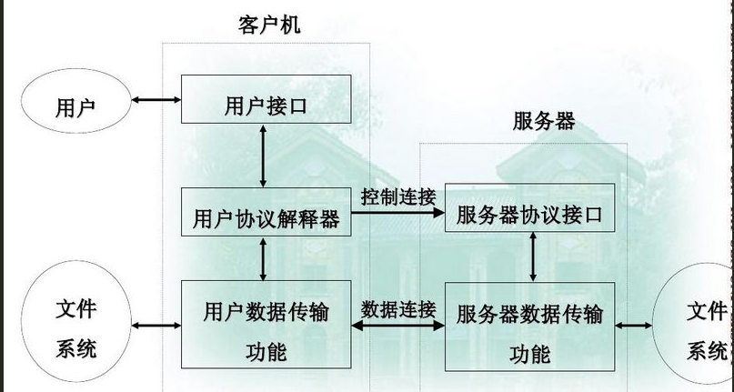

# FTP服务器自我实现版本
    程序员的进步来源于不断的练习，量变产生质变!

# 1.FTP协议那些事
## ftp 两种传输方式 ： ASCII 和 二进制

1. ftp如果以ASCII方式传输   
windows => linux        \r\n 转化为 \n   
linux   => windows      \n 转换为 \r\n

2. fpt如果二进制传输，那么不做任何解析 

## ftp 工作原理

## ftp 工作模式
1. 主动模式（PORT）:服务器主动向客户端建立数据连接  

2. 被动模式（PASV）:服务器被动接受客户端建立数据连接   

## NAT 与 FTP工作模式

如果客户端在内网，服务器无法直接连接到 PORT 发送IP和端口

如果客户端在内网,客户端能主动连接上PASV发送的服务器IP和端口

## ftp 命令

| 命令类型       | 命令          | 功能说明  |
| ------------- |:-------------:| -----:|
| 访问控制命令   | USER          | 服务器上的用户名 |
|               | PASS          |   用户口令    |
|               | CWD或XCWD     |  改变用户路径 |
|               | CDUP或XCCUP   |  回到上级目录 |
|               | QUIT          |  退出        |
|               | ACCT          |              |
|               | SMNT          |              |
|               | REIN          |              |
| 传输控制命令   | PORT          |数据端口，服务器发送客户端的连接端口             |
|               | PASV          |此命令要求服务器数据传输在随机端口监听，进入被动接收请求状态              |
|               | TYPE          |文件类型，ASCII或者二进制   |
|               | STRU          |文件结构   |
|               | MODE          |传输方式   |
| 服务命令       | RETR          |获得文件   |
|               | STOR          |保存文件，覆盖   |
|               | APPE          |保存文件，追加   |
|               | LIST          |列出目录详情   |
|               | NLIST         |列出名字列表   |
|               | REST          |重新开始   |
|               | ABORT         |异常终止   |

## ftp应答的数字含义

如220   

__第一位数字表示的含义__：
| 应答          | 说明          | 
| ------------- |:---------------:|
| 1yz           | 预备状态         | 
| 2yz           | 完成状态         |
| 3yz           | 中间状态         |  
| 4yz           | 暂时拒绝状态         | 
| 5yz           | 永久拒绝状态         | 

__第二位数字表示的含义__：
| 应答          | 说明          | 
| ------------- |:---------------:|
| x0z           | 语法错误         | 
| x1z           | 对于请求的信息响应         |
| x2z           | 控制连接和数据连接的响应         |  
| x3z           | 身份和验证账户         | 
| x4z           | 未使用         | 
| x5z           | 文件系统         | 

__第三位表示对第二位的更详细说明__：

500 格式错误，无法识别命令。     
501 参数语法错误。     
502 命令执行失败。     
503 命令顺序错误。     
504 命令所接的参数不正确。     
530 未登入。        
532 储存文件需要账户登入。     
550 未执行请求的操作。       
551 请求的命令终止，类型未知。       
552 请求的文件终止，储存位溢出。          
553 未执行请求的的命令，名称不正确。