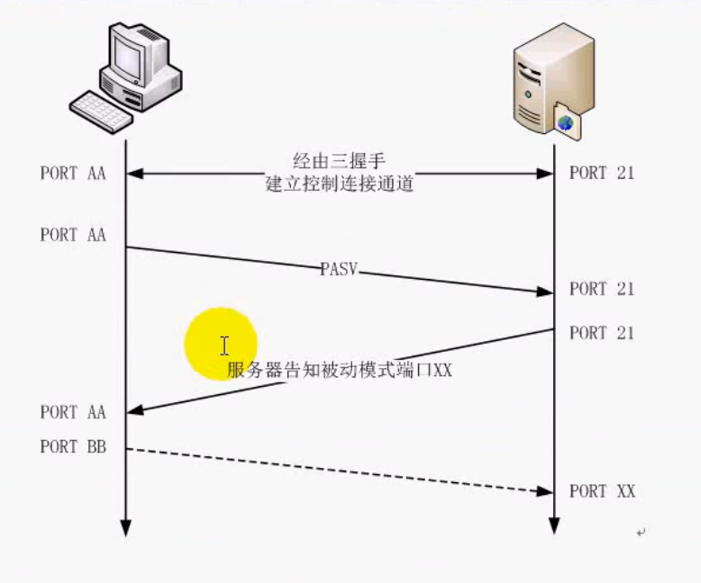

# FTP服务器自我实现版本
    程序员的进步来源于不断的练习，量变产生质变!

-----------------------------------------------

# 1.已实现的功能

1. ftp命令解析和功能实现
2. ftp参数配置
3. ftp空闲断开
4. 限速
5. 连接数限制（最大连接数 & 同一个IP连接数的限制）
6. 断点续传

-----------------------------------------------

# 2.FTP协议那些事
## ftp 两种传输方式 ： ASCII 和 二进制

1. ftp如果以ASCII方式传输   
windows => linux        \r\n 转化为 \n   
linux   => windows      \n 转换为 \r\n

2. fpt如果二进制传输，那么不做任何解析 

## ftp 工作原理

## ftp 工作模式
1. 主动模式（PORT）:服务器主动向客户端建立数据连接  

2. 被动模式（PASV）:服务器被动接受客户端建立数据连接   

## NAT 与 FTP工作模式

如果客户端在内网，服务器无法直接连接到 PORT 发送IP和端口

如果客户端在内网,客户端能主动连接上PASV发送的服务器IP和端口

## ftp 命令

| 命令类型       | 命令          | 功能说明  |
| ------------- |:-------------:| -----:|
| 访问控制命令   | USER          | 服务器上的用户名 |
|               | PASS          |   用户口令    |
|               | CWD或XCWD     |  改变用户路径 |
|               | CDUP或XCCUP   |  回到上级目录 |
|               | QUIT          |  退出        |
|               | ACCT          |              |
|               | SMNT          |              |
|               | REIN          |              |
| 传输控制命令   | PORT          |数据端口，服务器发送客户端的连接端口             |
|               | PASV          |此命令要求服务器数据传输在随机端口监听，进入被动接收请求状态              |
|               | TYPE          |文件类型，ASCII或者二进制   |
|               | STRU          |文件结构   |
|               | MODE          |传输方式   |
| 服务命令       | RETR          |获得文件   |
|               | STOR          |保存文件，覆盖   |
|               | APPE          |保存文件，追加   |
|               | LIST          |列出目录详情   |
|               | NLIST         |列出名字列表   |
|               | REST          |重新开始   |
|               | ABORT         |异常终止   |

## ftp应答的数字含义

如220   

__第一位数字表示的含义__： 

| 应答        | 说明           
| ------------- |:-------------:
| 1yz           | 预备状态             
| 2yz           | 完成状态         
| 3yz           | 中间状态         
| 4yz           | 暂时拒绝状态         
| 5yz           | 永久拒绝状态         

__第二位数字表示的含义__：   

| 应答          | 说明          
| ------------- |---------------
| x0z           | 语法错误         
| x1z           | 对于请求的信息响应         
| x2z           | 控制连接和数据连接的响应
| x3z           | 身份和验证账户         
| x4z           | 未使用  
| x5z           | 文件系统         

__第三位表示对第二位的更详细说明__：   

500 格式错误，无法识别命令。     
501 参数语法错误。     
502 命令执行失败。     
503 命令顺序错误。     
504 命令所接的参数不正确。     
530 未登入。        
532 储存文件需要账户登入。     
550 未执行请求的操作。       
551 请求的命令终止，类型未知。       
552 请求的文件终止，储存位溢出。          
553 未执行请求的的命令，名称不正确。

-----------------------------------------------

# 3.系统逻辑结构 

__！！多进程实现，绝对不能使用多线程，多个线程共享同一工作目录的__

__！！同样不能使用IO复用，IO复用针对多线程__

__一个客户端会建立两个进程，nobody进程和服务进程，服务进程与外界交互，nobody进程主要辅助服务进程__

# 4.Linux能力(capability)机制的继承

1、Linux能力机制概述   

在以往的UNIX系统上，为了做进程的权限检查，把进程分为两类：特权进程(有效用户ID是0)和非特权进程(有效用户ID是非0)。特权进程可以通过内核所有的权限检查，而非特权进程的检查则是基于进程的身份(有效ID，有效组及补充组信息)进行。

从linux内核2.2开始，Linux把超级用户不同单元的权限分开，可以单独的开启和禁止，称为能力(capability)。可以将能力赋给普通的进程，使其可以做root用户可以做的事情。

此时内核在检查进程是否具有某项权限的时候，不再检查该进程的是特权进程还是非特权进程，而是检查该进程是否具有其进行该操作的能力。例如当进程设置系统时间，内核会检查该进程是否有设置系统时间(CAP_SYS_TIME)的能力，而不是检查进程的ID是否为0；

当前Linux系统中共有37项特权，可在/usr/include/linux/capability.h文件中查看

2、Linux能力机制的实现

一个完整的能力机制需要满足以下三个条件:

1、对进程的所有特权操作，linux内核必须检查该进程该操作的特权位是否使能。

2、Linux内核必须提供系统调用，允许进程能力的修改与恢复。

3、文件系统必须支持能力机制可以附加到一个可执行文件上，但文件运行时，将其能力附加到进程当中。

到linux内核版本2.6.24为止，上述条件的1、2可以满足。从linux内核2.6.24开始，上述3个条件可以都可以满足

每个进程包括三个能力集，含义如下：

Permitted: 它是effective capabilities和Inheritable capability的超集。如果一个进程在Permitted集合中丢失一个能力，它无论如何不能再次获取该能力(除非特权用户再次赋予它)

Inheritable: 它是表明该进程可以通过execve继承给新进程的能力。

Effecitive: Linux内核真正检查的能力集。

从2.6.24开始，Linux内核可以给可执行文件赋予能力，可执行文件的三个能力集含义如下：

Permitted:该能力当可执行文件执行时自动附加到进程中，忽略Inhertiable capability。

Inheritable:它与进程的Inheritable集合做与操作，决定执行execve后新进程的Permitted集合。

Effective: 文件的Effective不是一个集合，而是一个单独的位，用来决定进程成的Effective集合。

有上述描述可知，Linux系统中的能力分为两部分，一部分是进程能力，一部分是文件能力，而Linux内核最终检查的是进程能力中的Effective。而文件能力和进程能力中的其他部分用来完整能力继承、限制等方面的内容。